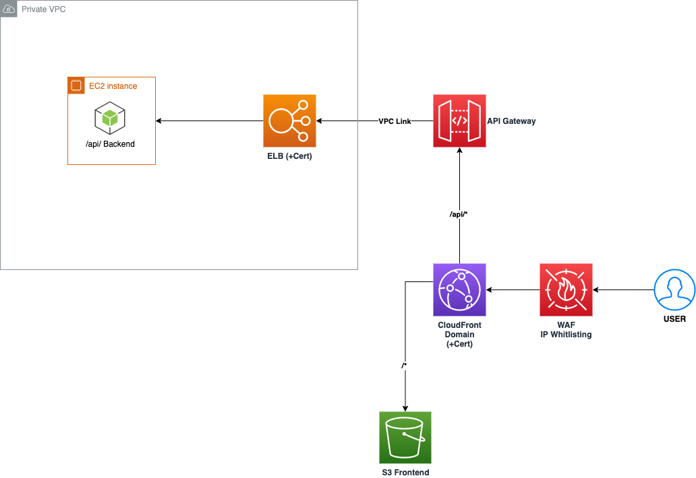

# terraform-cloudapp-infra Repository 
This repository contains scripts and the required Terraform files for setting up an example best-practice cloud web application infrastructure that involves AWS CloudFront, AWS S3 Bucket and AWS API Gateway. Specifically, it is designed to be used for [StranglerFigApplication](https://martinfowler.com/bliki/StranglerFigApplication.html) on AWS. 

An example usage of this repository is to provide a middle step cloud-native migration architecture during use cases like refactoring a monolithic application in to microservices on AWS. The architecture example blueprint can then be adjusted accordingly based on each individual use case during decoupling.



The repository contains the following:
* Scripts for running an example application architecture configuration.
* Terraform module-based configuration files.

## Prerequisites
* [Terraform](https://learn.hashicorp.com/tutorials/terraform/install-cli): Required to deploy the AWS infrastructure resources.
* [AWS account](https://aws.amazon.com): An AWS account required to deploy the terraform resources into.
* [A running AWS Network Load Balancer for the monolithic backend](https://aws.amazon.com/elasticloadbalancing/network-load-balancer/): An existing active monolithic backend NLB endpoint that can be linked to the deployed infrastructure.
* A running frontend service that can be uploaded to the deployed S3 bucket.

| Name | Version |
|------|---------|
| <a name="requirement_terraform"></a> [terraform](#requirement\_terraform) | >= 0.13.5 |
| <a name="requirement_aws"></a> [aws](#requirement\_aws) | >= 2.55 |


## Input environment variables configuration 
The required input variables for each module within the `./example/variables.tf` file can be customised and injected by sourcing the scripts and defining the environment variable with the `TF_VAR_` prefix (preferrably within a CI system) before running **terraform deploy**.

Example `./example/test.sh`:
```bash
export TF_VAR_env="test"
export TF_VAR_region="eu-west-2"
export TF_VAR_app_name="my-test-single-page-app"
export TF_VAR_dist_comment="my-test-distribution-comment"
export TF_VAR_default_root_object="index.html"
export TF_VAR_immutable_assets_path_pattern="/static/immutable/*"
export TF_VAR_response_403_page_path="/assets/accessDenied/accessForbidden.html"
export TF_VAR_response_404_page_path="/index.html"
export TF_VAR_price_class="PriceClass_100"
export TF_VAR_cache_max_ttl=60
export TF_VAR_cache_default_ttl=30
export TF_VAR_s3_bucket_name="my-single-page-app-s3-bucket"
```

Note:

    - It is required to input an existing NLB arn and its endpoint url for the stack to provision the VPC link and its integration configurations for the backend services.
    - The defualt root path and 403 page path is configured as an example for a single-page application and can be adjusted depending on your actual frontend service configurations.

## Deploy the example infrastructure
Run the following command to deploy the example resource stacks:

```bash
cd ./example
source ./test.sh
terraform init
terraform plan
terraform deploy
```

Run the following command to destroy the resources deployed above:

```bash
terraform destroy
```

## Module Structure
### Modules

| Name | Source |
|------|--------|
| <a name="module_backend"></a> [backend](#module\_backend) | ../modules/apigw_vpclink |
| <a name="module_frontend"></a> [frontend](#module\_frontend) | ../modules/cf_s3 |

### Resources
The following AWS Cloud resources will be provisioned into 2 different modules (frontend and backend infrasturcture stacks) and can be plugged into an existing codebase.:

**./cf_s3**: 
- [S3 bucket](https://aws.amazon.com/s3/): The S3 bucket where the frontend static files will be uploaded and stored. The name of the bucket will be defined as: `my-single-page-app-s3-bucket`.
- [CloudFront Distribution](https://aws.amazon.com/cloudfront/): The CloudFront distribution that will serve the static website. Included features: `Origin Access Identity` and `Caching`.
- [WAF IP Whitelist](https://aws.amazon.com/waf/): The WAF ACL IP whitelist associated with the provisioned CloudFront Distribution. Can be edited inside the root `./ip-ranges-whitelist.json` file.

**./apigw_vpclink**:
- [API Gateway](https://aws.amazon.com/api-gateway/): The API Gateway that is referenced inside the provisioned CloudFront distribution as one of the origin groups. This includes the `{proxy+}` deployment to a provisioned VPC Link connected to a pre-configured private NLB endpoint (e.g. targeting the exisitng backend monolithic EC2 instances).


### Inputs

| Name | Description | Type | Default | Required |
|------|-------------|------|---------|:--------:|
| <a name="input_app_name"></a> [app\_name](#input\_app\_name) | Application name | `string` | n/a | yes |
| <a name="input_cache_default_ttl"></a> [cache\_default\_ttl](#input\_cache\_default\_ttl) | Cache default TTL for default behavior | `number` | n/a | yes |
| <a name="input_cache_max_ttl"></a> [cache\_max\_ttl](#input\_cache\_max\_ttl) | Cache max TTL for default behavior | `number` | n/a | yes |
| <a name="input_default_root_object"></a> [default\_root\_object](#input\_default\_root\_object) | Default root object | `string` | n/a | yes |
| <a name="input_dist_comment"></a> [dist\_comment](#input\_dist\_comment) | Distribution comment | `string` | n/a | yes |
| <a name="input_env"></a> [env](#input\_env) | Environment | `string` | n/a | yes |
| <a name="input_immutable_assets_path_pattern"></a> [immutable\_assets\_path\_pattern](#input\_immutable\_assets\_path\_pattern) | Immutable assets path pattern | `string` | n/a | yes |
| <a name="input_metrics_enabled"></a> [metrics\_enabled](#input\_metrics\_enabled) | Specifies whether Amazon CloudWatch metrics are enabled for this method. | `bool` | `true` | no |
| <a name="input_price_class"></a> [price\_class](#input\_price\_class) | CloudFront Price Class | `string` | n/a | yes |
| <a name="input_region"></a> [region](#input\_region) | AWS Region | `string` | n/a | yes |
| <a name="input_response_403_page_path"></a> [response\_403\_page\_path](#input\_response\_403\_page\_path) | 403 response page path for single page application | `string` | n/a | yes |
| <a name="input_response_404_page_path"></a> [response\_404\_page\_path](#input\_response\_404\_page\_path) | 404 response page path for single page application | `string` | n/a | yes |
| <a name="input_s3_bucket_name"></a> [s3\_bucket\_name](#input\_s3\_bucket\_name) | S3 bucket name | `string` | n/a | yes |
| <a name="input_target_vpc_nlb_arn"></a> [target\_vpc\_nlb\_arn](#input\_target\_vpc\_nlb\_arn) | ARN of the private VPC for backend load balancers | `string` | n/a | yes |
| <a name="input_target_vpc_nlb_endpoint"></a> [target\_vpc\_nlb\_endpoint](#input\_target\_vpc\_nlb\_endpoint) | Endpoint url of the private VPC for backend load balancers | `string` | n/a | yes |

### Outputs

| Name | Description |
|------|-------------|
| <a name="output_api-gateway-url"></a> [api-gateway-url](#output\_api-gateway-url) | API Gateway URL |
| <a name="output_cloudfront_dist_id"></a> [cloudfront\_dist\_id](#output\_cloudfront\_dist\_id) | CloudFront Distribution ID |
| <a name="output_cloudfront_dist_url"></a> [cloudfront\_dist\_url](#output\_cloudfront\_dist\_url) | CloudFront Distribution URL |
| <a name="output_s3_bucket_name"></a> [s3\_bucket\_name](#output\_s3\_bucket\_name) | S3 bucket name |
